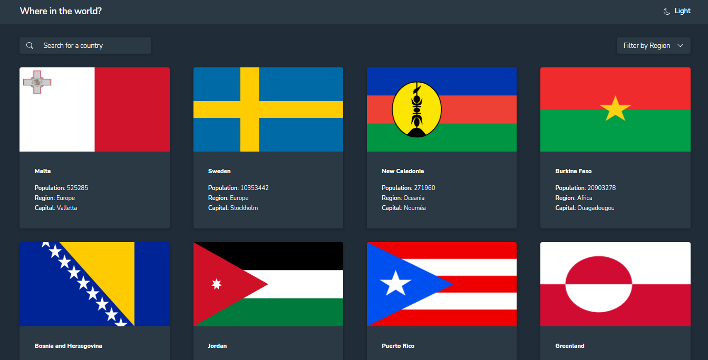

# Frontend Mentor - REST Countries API with color theme switcher solution

This is a solution to the [REST Countries API with color theme switcher challenge on Frontend Mentor](https://www.frontendmentor.io/challenges/rest-countries-api-with-color-theme-switcher-5cacc469fec04111f7b848ca). Frontend Mentor challenges help you improve your coding skills by building realistic projects. 

## Table of contents

- [Overview](#overview)
  - [The challenge](#the-challenge)
  - [Screenshot](#screenshot)
  - [Links](#links)
- [My process](#my-process)
  - [Built with](#built-with)
  - [What I learned](#what-i-learned)
- [Author](#author)

## Overview

### The challenge

Users should be able to:

- See all countries from the API on the homepage
- Search for a country using an `input` field
- Filter countries by region
- Click on a country to see more detailed information on a separate page
- Click through to the border countries on the detail page
- Toggle the color scheme between light and dark mode *(optional)*

### Screenshot

### Links

- Solution URL: [Frontend Mentor Solution](https://www.frontendmentor.io/solutions/rest-countries-info-react-app-for-mobile-and-desktop-StRY18ErU)
- Live Site URL: [Country Info Website](https://frontend-mentor-countries-info-app.vercel.app/)

## My process

### Built with

- Semantic HTML5 markup
- CSS custom properties
- Flexbox
- CSS Grid
- Mobile-first workflow
- [React](https://reactjs.org/) - JS library

### What I learned

Another React JS #reactjs web app which utilizes REST Countries API #api https://restcountries.com/ and uses dark and light themes.
The apps functionalities were pretty basic but the styling (theming) was the main challenge. I think I should have probably used Styled-Components but I chose to manage the styles my own way by using the Context API since I was already storing state over there.
In the end, am satisfied with the project (at least the themes) :)

## Author

- Website - [Raymond Adutwum Agyei](https://corps-ai.herokuapp.com)
- Frontend Mentor - [@alosoft](https://www.frontendmentor.io/profile/alosoft)
- Linkedin - [Raymond Adutwum Agyei](https://www.linkedin.com/in/raymond-adutwum-agyei-366929117/)